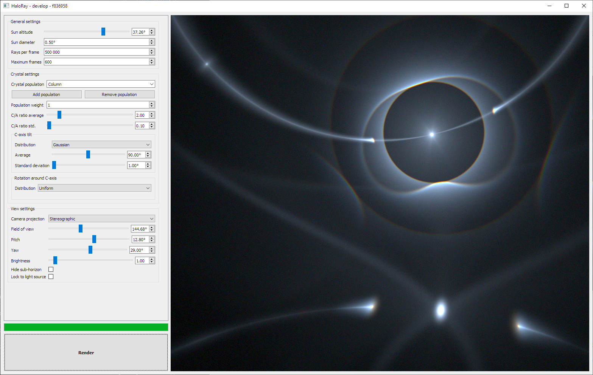

# HaloRay 
[](https://ci.appveyor.com/project/naavis/haloray/branch/develop)

HaloRay simulates the reflection and refraction of sun light inside hexagonal
ice crystals present in high altitude clouds in the atmosphere. These ice
crystals produce various optical phenomena in the sky, including bright spots,
circles and arcs.

HaloRay employs GPGPU to massively accelerate simulations. The simulation is
done using OpenGL compute and fragment shaders.

HaloRay currently supports Windows and Linux.



## How to use?

HaloRay is designed in such a way that pretty much every simulation parameter
can be tweaked in real time. The simulation traces a given number of light rays
through randomly generated ice crystals per rendered frame, and accumulates the
the results over time. Any time a simulation parameter is changed, the
simulation starts over.

All the simulation parameters are found on the left-hand side of the user
interface. Running the simulation can be started by clicking on the **Render**
button in the bottom left corner.

Camera orientation can be changed by clicking and dragging on the simulated
view, and the mouse scroll wheel can be used to change the field of view.

### General settings

Here are some general settings for the whole simulation.

- **Sun altitude:** Sun altitude from the horizon in degrees
- **Sun diameter:** Angular diameter of the sun in degrees
- **Rays per frame:** Number of rays traced through individual crystals per
    rendered frame
  - If the user interface slows down a lot during rendering, lower this value
  - On an NVIDIA GeForce GTX 1070 a good value seems to be around 500 000
  - The maximum value for this parameter may be limited by your GPU
- **Maximum frames:** Simulation stops after rendering this many frames
- **Double scattering:** Probability of a single light ray to scatter from two
  different ice crystals
  - Note that this slows down the simulation significantly!
  - The current implementation only does double scattering inside one crystal
    population
  - A value of 0.0 means no rays are scattered twice, and 1.0 means all rays
    are scattered twice

### Crystal settings

HaloRay allows you to simulate multiple different ice crystal populations
simultaneously. You give each population a name for easier reference by typing
in the **Crystal population** dropdown menu. Each population has a relative
weight, which can be changed by adjusting the **Population weight** spin box.
For example, giving weights 1 and 3 to two crystal populations respectively
would trace three times as many rays through the latter population than the
former.

The crystals are hexagonal, and have three named axes as shown in the image
below.


The orientation of the ice crystals in each population are defined by two
parameters: tilt of the crystal around the A-axis and rotation around the
C-axis. For each parameter you can currently choose between two different
random distributions: a uniform distribution and a Gaussian distribution. For
the Gaussian distribution you can choose an average angle and the standard
deviation of the distribution.

The following table shows parameters needed to simulate crystal orientations
known to happen in nature.

| Orientation | Tilt around a-axis | Rotation around c-axis |
|-------------|--------------------|------------------------|
| Column      | 90                 | Uniform                |
| Plate       | 0                  | Uniform                |
| Parry       | 90                 | 0                      |
| Lowitz      | Uniform            | 0                      |
| Random      | Uniform            | Uniform                |

The shape of the crystal can also be adjusted by changing the following
parameters:

- **C/A ratio average:** Ratio between the C-axis and A-axis lengths of
  of the crystal
- **C/A ratio std:** Standard deviation of the C/A ratio


Crystals with a large C/A ratio are look like pencil pieces, and are commonly
called column crystals. Column crystals tend to orient themselves with the
C-axis horizontal. Crystals with a small C/A ratio are called plate
crystals. They tend to orient themselves with the C-axis vertical. Both
kinds of crystals are shown in the image above.

### View settings

These settings affect how the results of the simulation are shown on the screen.

- **Camera projection:** Defines how the view is projected to the screen
- **Field of view:** Vertical field of view in degrees
- **Pitch:** Vertical orientation of the camera in degrees from the horizon
- **Yaw:** Horizontal orientation of the camera in degrees from the sun's direction
- **Brightness:** Alters the total brightness of the image, much like an exposure adjustment on cameras
- **Hide sub-horizon:** Hides any halos below the horizon level
- **Lock to light source:** Locks the camera to the sun

## How to build?

HaloRay requires an OpenGL 4.4 compliant GPU.

The user interface is built with [Qt 5](https://www.qt.io/), so you need to
[download the Qt libraries](https://www.qt.io/download-qt-installer) before
compiling HaloRay.

The build is handled with Qt's build tool qmake.

On Linux you can also install Qt using your package manager. On Ubuntu Linux
you can install Qt by running:

```bash
sudo apt-get install qt5-default
```

On Windows you need to set either `Qt5_DIR` or `CMAKE_PREFIX_PATH` environment
variable to point to the Qt prefix path, e.g.
`C:\Qt\5.12.3\msvc2017_64\`

Finally build the project by running:

```bash
mkdir build
cd src
qmake.exe main.pro -o ..\build\
cd ..\build
make
```

You can use `nmake` instead of `make` on Windows.

On Windows you need to add the Qt5 binary directory to your PATH environment
variable or copy at least the following Qt DLL files to the same folder as the
resulting executable:

- Qt5Core.dll
- Qt5Widgets.dll
- Qt5Gui.dll
- Qt5Svg.dll

You can also do this automatically with the
[windeployqt](https://doc.qt.io/qt-5/windows-deployment.html) tool, which is
shipped with Qt 5. This is the recommended way.

You can check `scripts\build.ps1` to see how the project is built on the
Appveyor CI server.

## Acknowledgments

- [Lauri Kangas](https://github.com/lkangas) for providing tons of reading material and debugging help
- [Panu Lahtinen](https://github.com/pnuu) for additional Linux support
- Jukka Ruoskanen for making HaloPoint 2.0 back in the day and inspiring me to start working on HaloRay
- [Jaakko Lehtinen](https://users.aalto.fi/~lehtinj7/) for super valuable lessons in computer graphics

