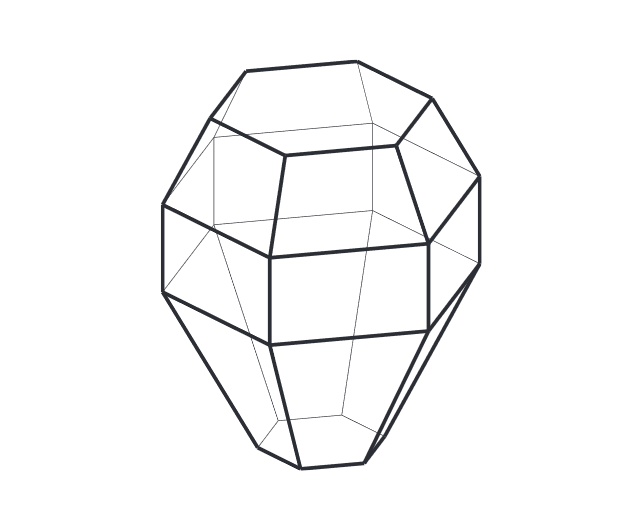

# HaloRay 

[](https://ci.appveyor.com/project/naavis/haloray/branch/develop)

HaloRay simulates the reflection and refraction of sun light inside hexagonal
ice crystals present in high altitude clouds in the atmosphere. These ice
crystals produce various optical phenomena in the sky, including bright spots,
circles and arcs.

HaloRay employs GPGPU to massively accelerate simulations. The simulation is
done using OpenGL compute and fragment shaders.

HaloRay currently supports Windows and Linux.

An OpenGL 4.4 compliant GPU is required to run HaloRay. On Windows you also need
the [latest Microsoft Visual C++ Redistributable for Visual Studio 2019.](https://aka.ms/vs/16/release/vc_redist.x64.exe)


## How to use?

HaloRay is designed in such a way that pretty much every simulation parameter
can be tweaked in real time. The simulation traces a given number of light rays
through randomly generated ice crystals per rendered frame, and accumulates the
the results over time. Any time a simulation parameter is changed, the
simulation starts over.

All the simulation parameters are found on the left-hand side of the user
interface. Running the simulation can be started by clicking on the **Render**
button in the bottom left corner.

Camera orientation can be changed by clicking and dragging on the simulated
view, and the mouse scroll wheel can be used to change the field of view.

### General settings

Here are some general settings for the whole simulation.

- **Sun altitude:** Sun altitude from the horizon in degrees
- **Sun diameter:** Angular diameter of the sun in degrees
- **Rays per frame:** Number of rays traced through individual crystals per
  rendered frame
  - If the user interface slows down a lot during rendering, lower this value
  - On an NVIDIA GeForce RTX 3070 a good value seems to be around 500 000
  - The maximum value for this parameter may be limited by your GPU
- **Maximum frames:** Simulation stops after rendering this many frames
- **Double scattering:** Probability of a single light ray to scatter from two
  different ice crystals
  - Note that this slows down the simulation significantly!
  - The current implementation only does double scattering inside one crystal
    population
  - A value of 0.0 means no rays are scattered twice, and 1.0 means all rays
    are scattered twice

### Atmosphere settings

HaloRay renders a realistic sky and sun disk based on a blend of Hosek-Wilkie and
Preetham models. The sky model has only a few adjustable parameters:

- **Atmosphere enabled:** Toggles rendering of the sky and sun
- **Turbidity:** The amount of aerosols/haze in the atmosphere
- **Ground albedo:** Albedo of the ground plane
  - 0.0 means the ground does not reflect any light
  - 1.0 means the ground reflects all light

### Crystal settings

HaloRay allows you to simulate multiple different ice crystal populations
simultaneously. You give each population a name for easier reference by typing
in the **Crystal population** dropdown menu. Each population has a relative
weight, which can be changed by adjusting the **Population weight** spin box.
For example, giving weights 1 and 3 to two crystal populations respectively
would trace three times as many rays through the latter population than the
former.

The crystals are hexagonal, and have three named axes as shown in the image
below.


The orientation of the ice crystals in each population are defined by two
parameters: tilt of the crystal around the A-axis and rotation around the
C-axis. For each parameter you can currently choose between two different
random distributions: a uniform distribution and a Gaussian distribution. For
the Gaussian distribution you can choose an average angle and the standard
deviation of the distribution.

The following table shows parameters needed to simulate crystal orientations
known to happen in nature.

| Orientation | Tilt around a-axis | Rotation around c-axis |
| ----------- | ------------------ | ---------------------- |
| Column      | 90                 | Uniform                |
| Plate       | 0                  | Uniform                |
| Parry       | 90                 | 0                      |
| Lowitz      | Uniform            | 0                      |
| Random      | Uniform            | Uniform                |

The shape of the crystal can also be adjusted by changing the following
parameters:

- **C/A ratio average:** Ratio between the C-axis and A-axis lengths of
  of the crystal
- **C/A ratio std:** Standard deviation of the C/A ratio


Crystals with a large C/A ratio are look like pencil pieces, and are commonly
called column crystals. Column crystals tend to orient themselves with the
C-axis horizontal. Crystals with a small C/A ratio are called plate
crystals. They tend to orient themselves with the C-axis vertical. Both
kinds of crystals are shown in the image above.

The ice crystals also have adjustable pyramidal end caps. Both the upper and
lower caps have the following settings:

- **Apex angle:** Defines the apex angle of the pyramid cap in degrees
  - Ranges from 0.0 to 180.0 degrees, where low numbers mean a very pointy cap
    while high numbers mean the opposite
  - Typically the apex angle is 56 degrees on water ice crystals
- **Apex average height:** Defines the height of the pyramid cap
  - Ranges from 0.0 to 1.0, where 0.0 means the cap is totally flat and 1.0
    means a cap that converges to a sharp point
- **Apex height std:** Standard deviation of the pyramid cap height



Above is a representation of an ice crystal with pyramidal end caps.
Currently HaloRay is limited to convex ice crystals, so the end caps
cannot extend inwards to make hollow ice crystals.

HaloRay provides six sliders you can use to adjust the **distance of each prism
face** of the hexagonal ice crystals from the crystal C-axis.


The above image shows a crystal where every other prism face has the default
distance of 1.0 from the C-axis, while every other is reduced to 0.7.

### View settings

These settings affect how the results of the simulation are shown on the screen.

- **Camera projection:** Defines how the view is projected to the screen
- **Field of view:** Vertical field of view in degrees
- **Pitch:** Vertical orientation of the camera in degrees from the horizon
- **Yaw:** Horizontal orientation of the camera in degrees from the sun's direction
- **Brightness:** Alters the total brightness of the image, much like an exposure adjustment on cameras
- **Hide sub-horizon:** Hides any halos below the horizon level
- **Lock to light source:** Locks the camera to the sun

### Menus

The top menus should be pretty self-explanatory. Entries in the _File_ menu
allow you to reset the simulation, save and load simulation parameters, and save
the simulation output to an image file on disk.

_View -> Crystal preview_ lets you see a wireframe preview of the an average
ice crystal in the currently selected crystal population.

## How to build?

The user interface is built with [Qt 5](https://www.qt.io/), so you need to
[download the Qt libraries](https://www.qt.io/download-qt-installer) before
compiling HaloRay.

The build is handled with Qt's build tool qmake. You can also use the Qt Creator
IDE to open and build the code.

On Linux you can install Qt using your package manager. On Ubuntu Linux you can
install Qt by running:

```bash
sudo apt-get install qt5-default
```

Finally build the project by running:

```bash
mkdir build
cd src
qmake main.pro -o ..\build\
cd ..\build
make
```

You can use `nmake` instead of `make` on Windows.

On Windows you need to add the Qt5 binary directory to your PATH environment
variable or copy at least the following Qt DLL files to the same folder as the
resulting executable:

- Qt5Core.dll
- Qt5Widgets.dll
- Qt5Gui.dll
- Qt5Svg.dll

You can also do this automatically with the
[windeployqt](https://doc.qt.io/qt-5/windows-deployment.html) tool, which is
shipped with Qt 5. This is the recommended way.

You can check `scripts\build.ps1` to see how the project is built on the
Appveyor CI server.

## FAQ - Frequently asked questions

### UI components are scaled all wrong on a 4K display in Windows, what to do?

On high-DPI screens Windows scales UI elements by default. HaloRay doesn't fully
adapt to this scaling yet. For now, you can either disable the scaling on an
operating system level by setting UI scale to 100% in Windows display settings,
or try running HaloRay with
[special command-line parameters](https://doc.qt.io/qt-5/qguiapplication.html#platform-specific-arguments)
like this:

```
HaloRay.exe -platform windows:dpiawareness=2
```

### HaloRay crashes or does not start, how to troubleshoot?

HaloRay writes a log file to help in troubleshooting.

On Windows you can find it in `%LOCALAPPDATA%\Temp\haloray\haloray.log` where
`%LOCALAPPDATA` is usually equal to `C:\Users\<username>\AppData\Local`

On Linux the log file is in `/tmp/haloray/haloray.log`

## Acknowledgments

- [Lauri Kangas](https://github.com/lkangas) for providing tons of reading material and debugging help
- [Panu Lahtinen](https://github.com/pnuu) for additional Linux support
- Jukka Ruoskanen for making HaloPoint 2.0 back in the day and inspiring me to start working on HaloRay
- [Jaakko Lehtinen](https://users.aalto.fi/~lehtinj7/) for super valuable lessons in computer graphics
