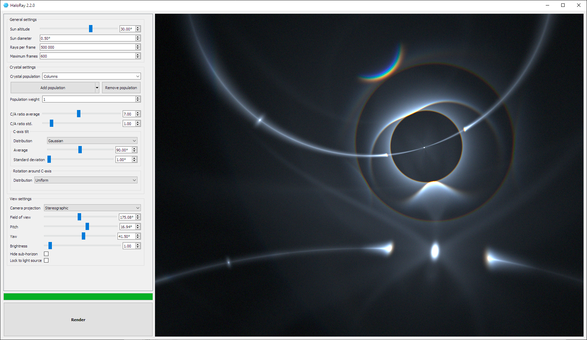
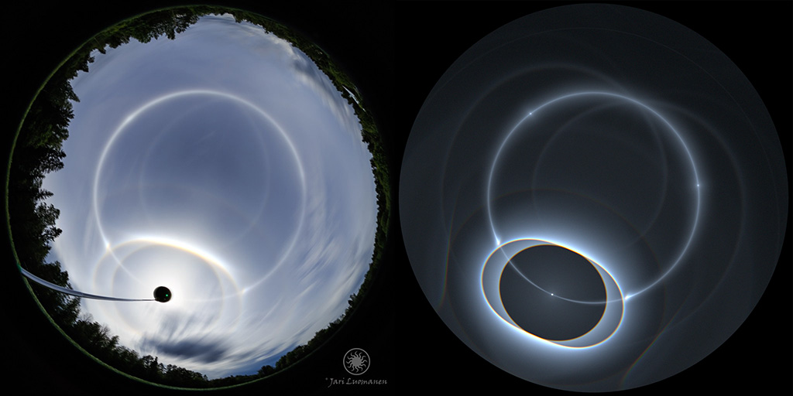

HaloRay simulates the reflection and refraction of sun light inside hexagonal
ice crystals present in high altitude clouds in the atmosphere. These ice
crystals produce various optical phenomena in the sky, including spots,
circles and arcs. These are all called ice crystal halos.

HaloRay massively accelerates simulations by running all the work on the
Graphics Processing Unit (GPU) using OpenGL compute and fragment shaders.
This means that **simulations run thousands of times faster than before!**
On a modern GPU HaloRay can trace over 30 million light rays through ice
crystals every second.

Because of this speed advantage, HaloRay has been designed from the start to be
very interactive. Nearly every parameter can be tweaked in real time when the
simulation is running!

Comparison between
[a photo by Jari Luomanen](https://jari.pic.fi/kuvat/Atmospheric+phenomena+and+sky/Atmospheric+halos/2014_06_24+Exceptional+High+Cloud+Halo+Display/_MG_0573-_MG_0610.jpg)
and a HaloRay simulation.
